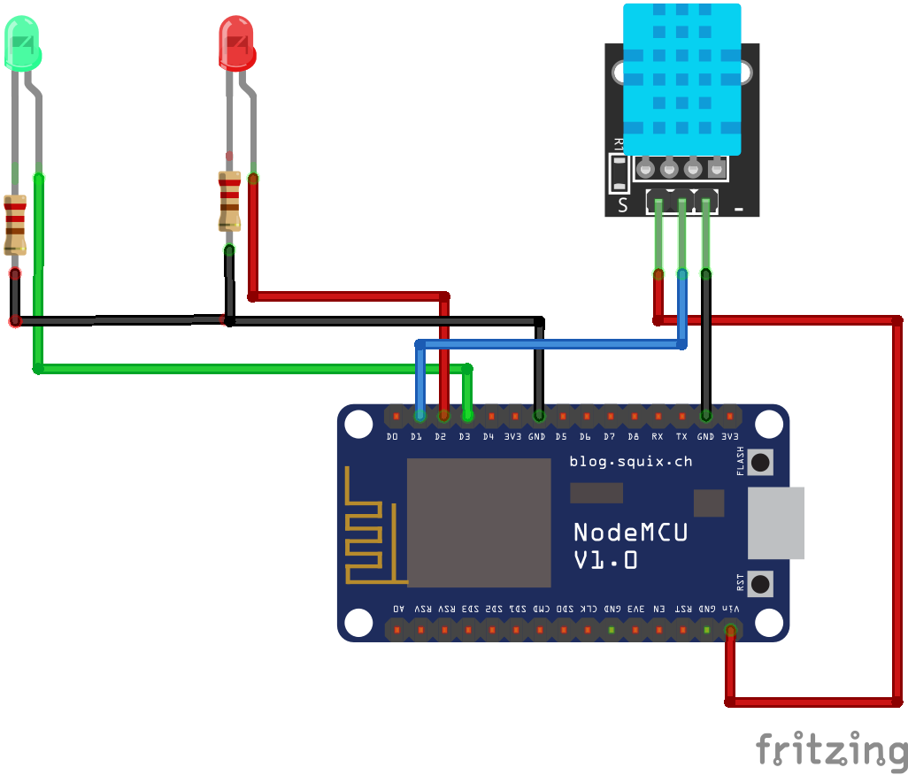
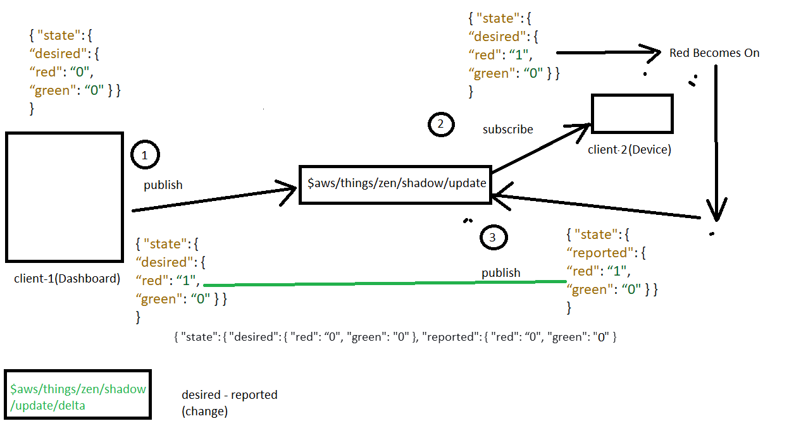

# AWS IoT Core with ESP8266

## CODE WITH DESCRIPTION

1. aws_esp/aws_esp.ino -> Approach 1 discussed in the youtube Session.

2. aws_esp_pubsub/aws_esp_pubsub.ino -> Approach 2 discussed in the youtube Session.

## CIRCUIT DIAGRAM

## Architecture with ThingShadow Topics

## LINK FOR WRITTEN BLOG

